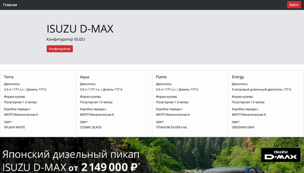

# Isuzu

Конфигуратор пикапов Isuzu c функцией сравнения с предложениями конкурентных предложений.

### Интерфейс:

### Личный кабинет:

Администратор добавляет опции и конфигурации автомобиля, а так же сам заполняет предложения конкурирующих компаний.
Новые администраторы добавляются через главного администратора.

Запуск программы: 

> npm i

> npm start

Используемые технологии: HTML, CSS, Bootstrap Node js, Express, Mongoose и другие.

